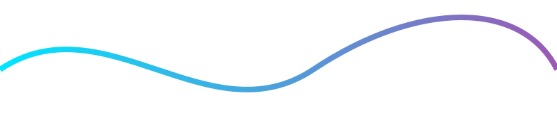
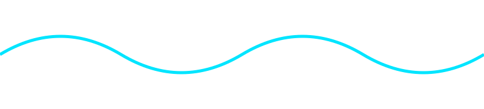
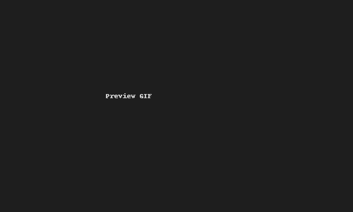

<!-- Animated Neon Header -->

  

<h1 align="center">Hi, I'm Kunal Singh 👋</h1>

  <a href="mailto:kunalsingh203001@gmail.com">Email</a> •
  <a href="https://www.linkedin.com/in/kunal-singh-454368289">LinkedIn</a> •
  <a href="https://github.com/72897">GitHub</a>

  <em>Final-year B.Tech CSE @ Gautam Buddha University | Generative AI + MERN Developer | Building real-world AI-first apps</em>

---

## 🧩 Quick Stats & Badges

---

## 🔭 Currently Working On
- **Generative AI applications** (RAG, embeddings, evals, routing)
- **Full-stack projects** using **Next.js, Node.js, MongoDB, Firebase**
- **AI automation & integration** in real-world workflows

---

## 💼 Experience
- **Engineering Intern — Thales, Noida (Jun 2025 – Jul 2025)**  
  ➝ Built a Generative AI pipeline (Gemini + OpenAI) → +30% relevance, -25% latency  
  ➝ Fully documented production demo  

- **Full-Stack Developer Intern — MI Matdar (Feb 2025 – Apr 2025)**  
  ➝ React frontend + backend optimizations  
  ➝ API speed improved ~40%  
  ➝ MongoDB schema redesign  

---

## 🎥 Project Preview GIFs

  
  

---

## 🌈 Gradient Skill Section

  
  
  

---

## 🧠 Pinned Project Cards

  
  

---

## 🔮 Aesthetic Divider

  

---

# 🔬 Tech DNA — Visualizing My Stack

  

> **Tech DNA:** Animated ribbon showing layers: Infra → Backend → Models → Frontend → Tools.

---

# 🪟 Glassmorphism Cards

  
  

---

# 🧰 Toolbox Grid

  
   
  <small>Tools I use daily.</small>

---

# 🕰️ Timeline — Experience & Milestones

<strong>📅 Click to expand</strong>

- **Jun 2025 – Jul 2025** — Engineering Intern @ Thales  
- **Feb 2025 – Apr 2025** — Full-Stack Intern @ MI Matdar  
- **2024 – Present** — Building AI-first apps  
- **2022 – 2026** — B.Tech CSE @ GBU  

---

# 🌀 Contribution Graph Animation

  

---

# 🎮 Daily Streak Game (Playable)

  <a href="assets/snake-game/index.html">▶ Play Snake Game Based on My GitHub Grid</a>
    
  

---

## 📈 GitHub Stats

  
   
  
   
  

---

## 🏆 Trophies

  

---

## 📊 Visitors

  

---

⭐ If you like my projects, consider giving them a star!

